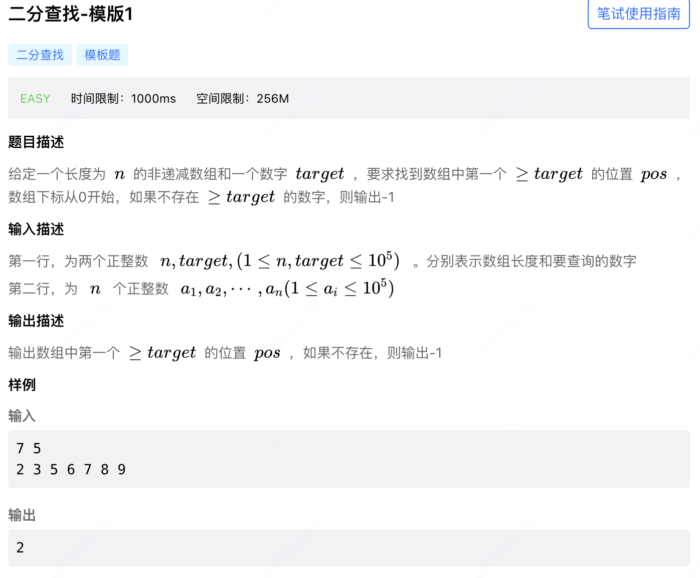
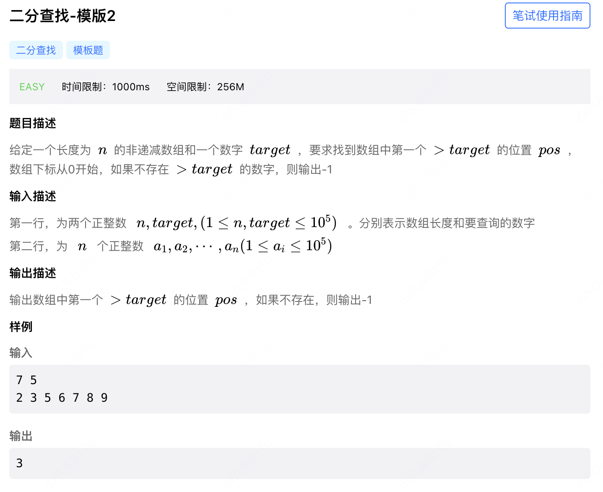
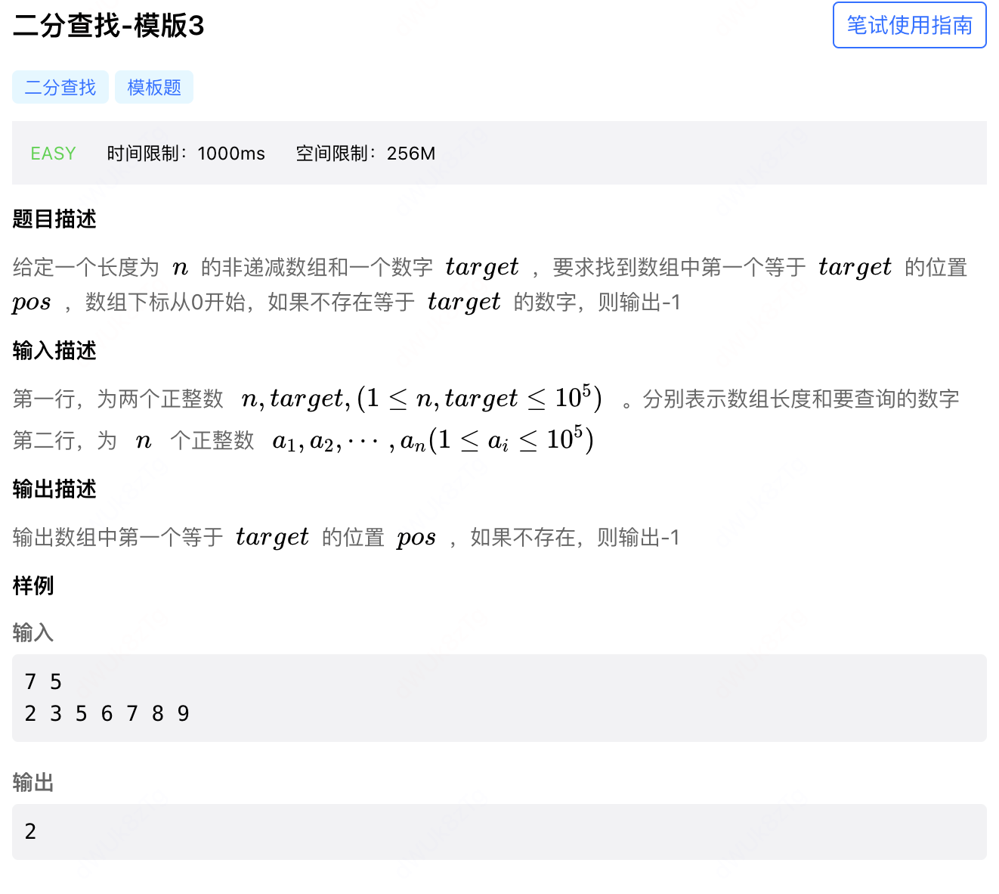

  

```java
  _____
  ____|___
  |   |
1 2 2 2 3
r l   r l
  ⬆️

import java.util.Scanner;
class Main{
    public static void main(String[] args){
        Scanner in=new Scanner(System.in);
        int n=in.nextInt();
        int target=in.nextInt();
        int[] q=new int[n];
        for(int i=0;i<n;i++){
            q[i]=in.nextInt();
        }
        int l=0,r=n-1;
        while(l<=r){
            int mid=l+r>>1;
            // 相等了还要移动右指针，往左寻找
            if(q[mid]>=target)r=mid-1;
            else l=mid+1;
        }
        if(l==n)
            System.out.print(-1);
        else
            System.out.print(l);
    }
}
```

  

```java
  _____
  ____|___
  |   |
1 2 2 2 3
r l   r l
        ⬆️
import java.util.Scanner;
class Main{
    public static void main(String[] args){
        Scanner in=new Scanner(System.in);
        int n=in.nextInt();
        int target=in.nextInt();
        int[] q=new int[n];
        for(int i=0;i<n;i++){
            q[i]=in.nextInt();
        }
        int l=0,r=n-1;
        while(l<=r){
            int mid=l+r>>1;
            // 相等了还要移动左指针，往右寻找
            if(q[mid]<=target)l=mid+1; 
            else r=mid-1;
        }
        if(l==n)
            System.out.print(-1);
        else
            System.out.print(l);
    }
}
```

  

只需要对模版1的代码稍作修改即可AC。

```java
import java.util.Scanner;
class Main{
    public static void main(String[] args){
        Scanner in=new Scanner(System.in);
        int n=in.nextInt();
        int target=in.nextInt();
        int[] q=new int[n];
        for(int i=0;i<n;i++){
            q[i]=in.nextInt();
        }
        int l=0,r=n-1;
        while(l<=r){
            int mid=l+r>>1;
            if(q[mid]>=target)r=mid-1;
            else l=mid+1;
        }
        if(l==n||q[l]!=target)   // 唯一修改
            System.out.print(-1);
        else
            System.out.print(l);
    }
}
```